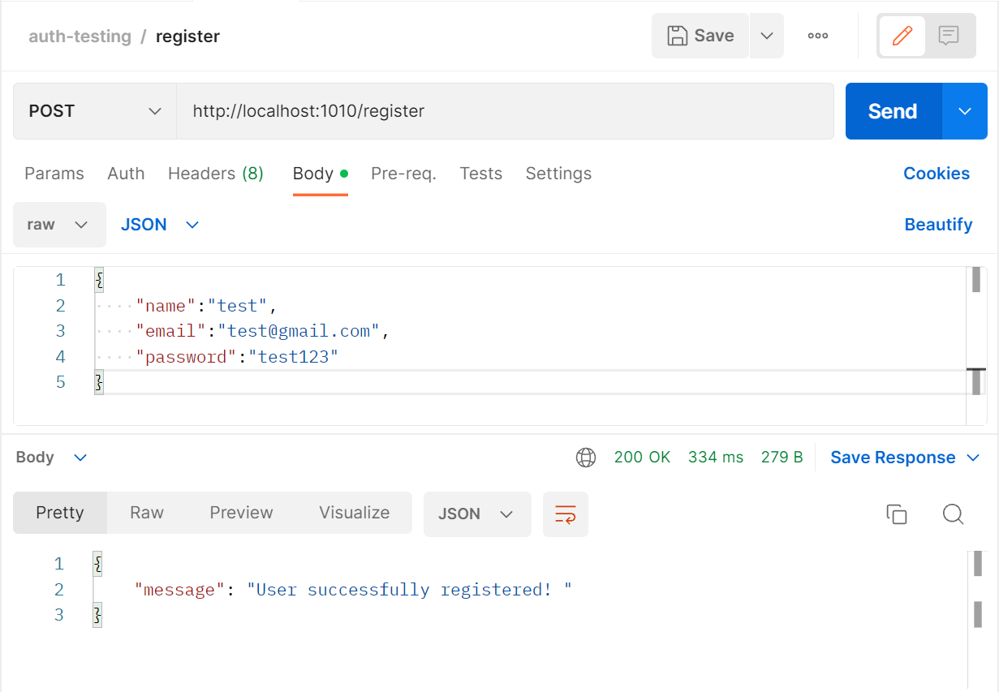
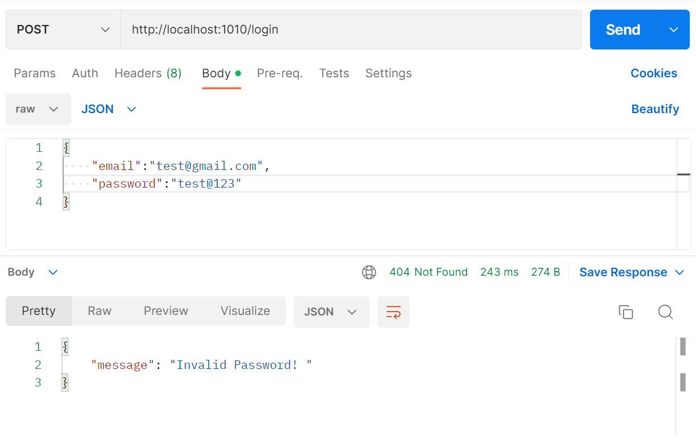
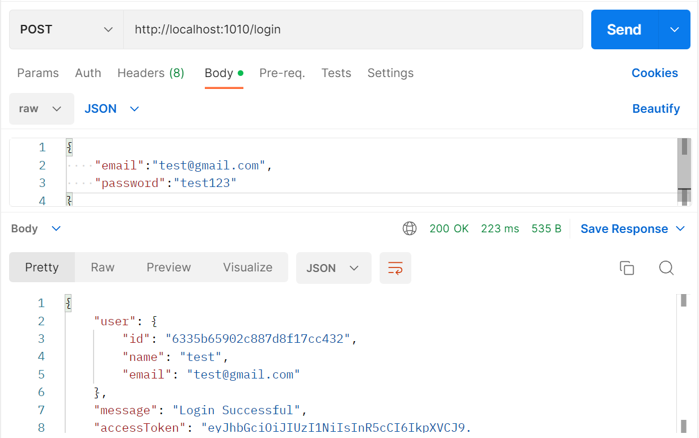
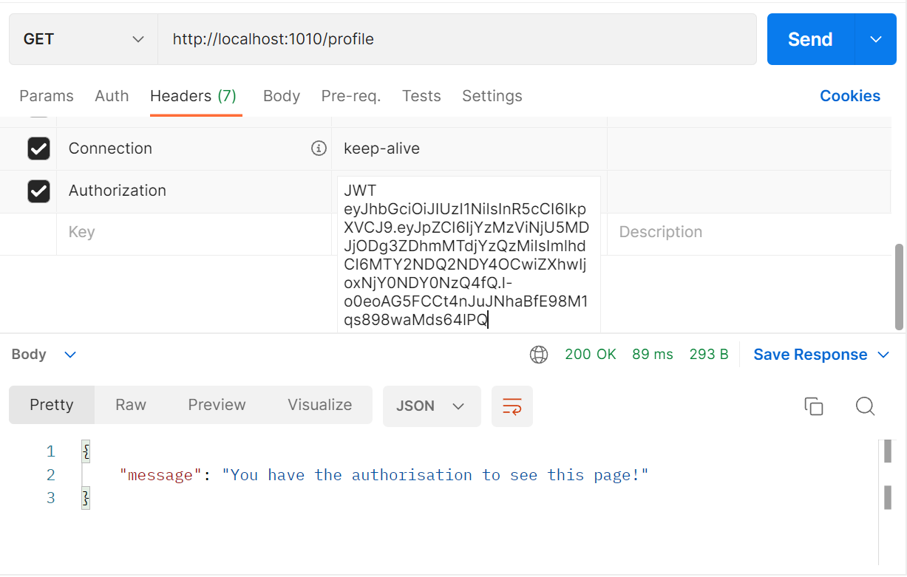
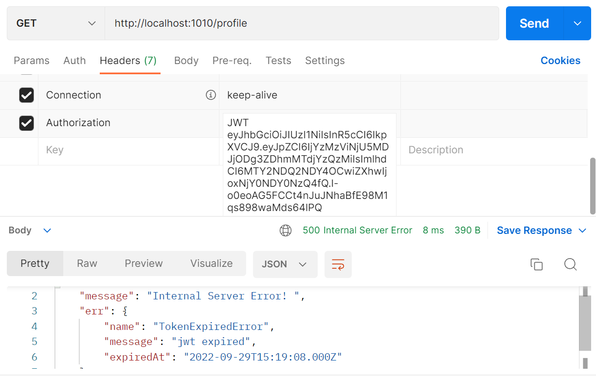
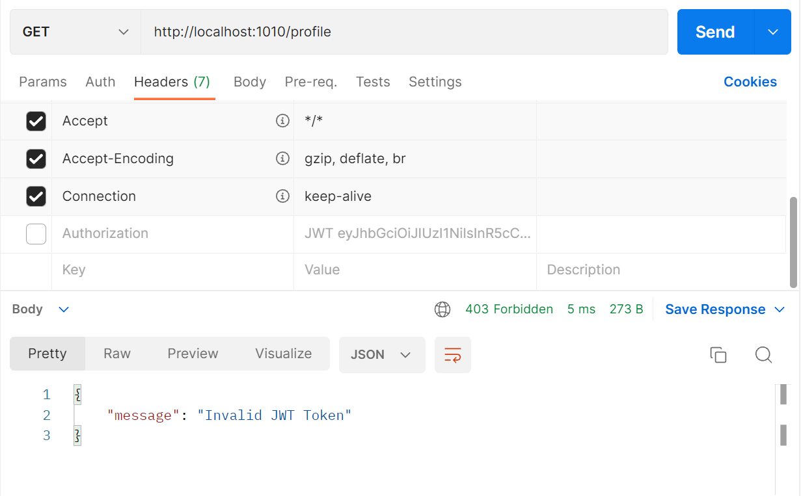

# Express.js API

## Authentication & Authorisation (JWT Token)
I have implemented JWT (Json Web Token) based authentication & authorisation in Express.js while integrating it with a database(MongoDB) for storing user data.

We will send requests through postman to test the API and I have attached the screenshots of the same!

---

## Screenshots
For doing registration:

For doing login (wrong password) :

For doing login (correct password) :

For testing auth:

When JWT would expire:

When JWT is invalid or not attached:

---